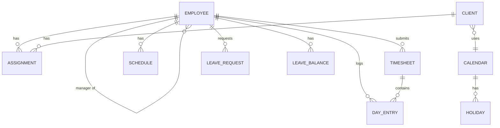
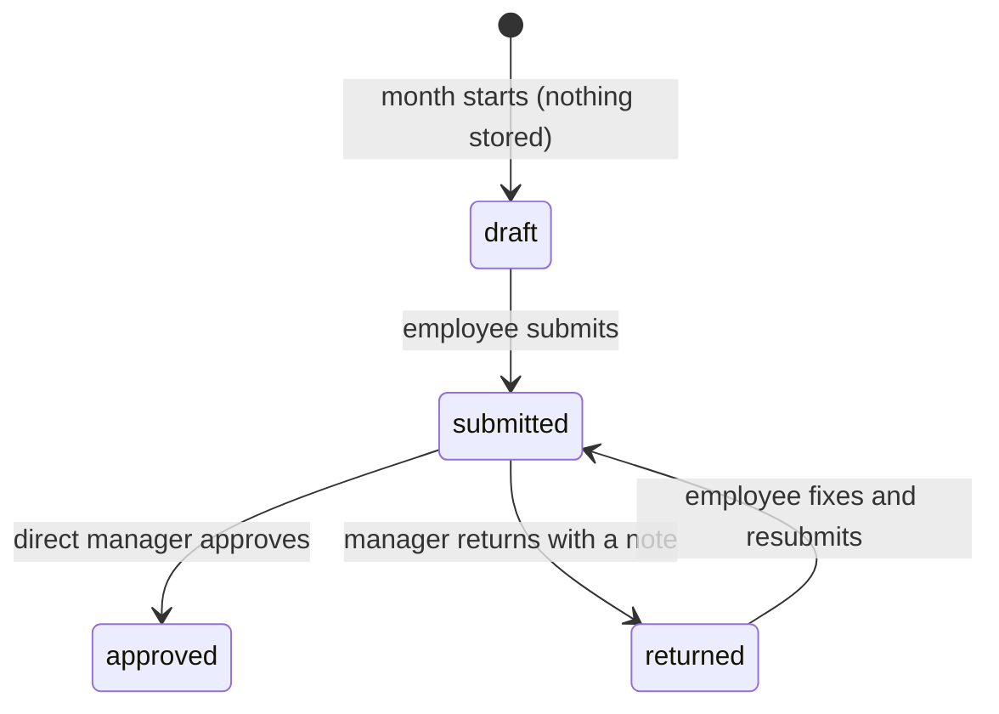

# Technical design — Phase 1

Companion to the product plan ([Plan v0.1](https://claude.ai/code/artifact/2644cbbc-032f-4bd5-9c32-532e915d4536)).
This file covers how it's built. Anything marked **Open** waits on a decision in the plan.

## Stack (proposed — confirm with the team)

| Part | Choice | Why |
|---|---|---|
| Language | TypeScript everywhere | One language for rules, server and UI |
| App | Next.js (React) | Server + UI in one project; good Arabic/RTL support |
| Database | PostgreSQL | Reliable, standard, easy to back up |
| Sign-in | Google (company accounts only) | EMS already uses Google; no passwords to manage |
| Excel | ExcelJS | Import people/holidays, export for Finance |
| ORM | Drizzle | Typed SQL; plain migration files |
| Local DB | PGlite | Embedded PostgreSQL: no setup for developers and tests |
| Tests | Vitest | Fast; the rules engine is covered first |

The rules engine (`src/domain/`) has no framework dependencies, so it stays valid whatever the app layer becomes.

## Code layout

```
src/app/             Next.js pages and server actions (thin: check permission, call src/server, redirect)
src/server/          database reads/writes, validation, Excel import, permissions, audit log
src/db/              schema (Drizzle) and connection; migrations in drizzle/
src/i18n/            English and Arabic text
src/domain/          rules engine: pure functions, no database, no UI
  types.ts           core concepts (calendar, client, assignment, schedule, day types)
  dates.ts           time-zone-safe date and time helpers
  dayRules.ts        resolveDay(): what kind of day is this for this person?
  timesheet.ts       prefill, day totals, overtime, checks, month summary
  leave.ts           leave days used, annual entitlement, balance
  __tests__/         one test per rule in the plan
```

## Data model



| Table | Key fields |
|---|---|
| employee | id, name (en/ar), email (Google), job title, manager_id, hire_date, roles, active |
| client | id, name (en/ar), calendar_id |
| calendar | id, name, work_week (weekday list) |
| holiday | calendar_id, date, name (en/ar) |
| assignment | employee_id, client_id, start, end (null = open), primary |
| schedule | employee_id, effective_from, start, end, break_minutes, shift_code |
| shift | code (A/B/C), start, end — **Open:** times |
| day_entry | employee_id, date, worked_minutes, leave_type, leave_portion, note, client_id |
| timesheet | employee_id, year, month, status (draft/submitted/returned/approved/locked), decided_by, decided_at, note |
| leave_request | employee_id, type, from, to, half_day, days_used, status, attachment, decided_by |
| leave_balance | employee_id, year, type, entitlement, carried_over, adjustments |
| overtime_rate | type (regular/special/off_day), multiplier, effective_from |
| audit_log | who, when, table, row, before, after |

Only **changed** days are stored as `day_entry` rows; everything else is computed from the rules on read.
A month is frozen (entries + computed totals saved) when HR locks it, so later rule or calendar changes don't rewrite history.

## Rules (implemented in `src/domain/dayRules.ts`)

Checked top to bottom; the first match wins.

| # | Situation | Day type | Leave used? | Tested in |
|---|---|---|---|---|
| 1 | Any assigned client has a holiday | `client_holiday` | No | dayRules.test.ts |
| 2 | Not a working day in the **primary** client's week | `weekend` | No | dayRules.test.ts |
| 3 | Client working day + Jordan holiday | `special_overtime` (all hours ×1.2) | Yes, if taken off | dayRules / timesheet / leave tests |
| 4 | Client working day | `working` | Yes, if taken off | dayRules.test.ts |
| – | No active assignment | `unassigned` (flagged for HR) | – | dayRules.test.ts |

Decisions baked in (change here if the team disagrees):
- With two clients, the **primary** assignment sets the work week and hours; a holiday at **either** client is a day off.
- People between projects get an assignment to an internal client ("EMS Internal") with the Jordan calendar, instead of a special case.
- Hours worked on a client weekend or holiday are **off-day overtime** — **Open:** its rate. Regular overtime rate is also **Open**; both default to 1.0 in tests.
- Annual leave: 14 days, 21 after 5 years of service (Jordan law as we understand it) — **Open:** HR to confirm.

## Timesheets (implemented in `src/server/timesheets.ts`)



- Only days that differ from the schedule are stored (`day_entries`). Saving a day back to its schedule deletes the row.
- A full day of leave always counts 0 hours worked; a half day uses the times entered.
- Only the person edits their own timesheet, and only while it's a draft or returned.
- Their **direct manager** approves or returns it (a note is required to return). Nobody decides on their own timesheet; admins cover people with no manager.
- Colleagues can't see each other's timesheets; HR, Finance and Admin can view any, read-only.
- Month totals are frozen into `timesheets.totals` at submit and at approval.
- Leave is entered on the timesheet for now; stage 4 adds leave requests that place approved leave automatically.
- **Open:** splitting one day's hours across two clients; locking a month for payroll (stage 5, with the Finance export).

## Time off (implemented in `src/server/leave.ts`)

- A request shows exactly which days it uses before it's sent: weekends and client holidays are skipped;
  a Jordanian holiday while the client works is a workday, so it counts.
- Refused: no working days in range, overlapping another pending/approved request, crossing into a new year,
  and annual leave beyond the balance. Sick leave beyond the allowance still goes to the manager.
- The direct manager approves or declines (reason optional), seeing teammates off on the same dates.
- Approval writes the leave onto the timesheet (half day = half the scheduled hours). It's refused if that month
  is already submitted or approved.
- The person can cancel a pending request, or approved leave that hasn't started; cancelling removes it from the timesheet.
- Balance = entitlement + HR adjustments − taken − pending, per calendar year, for annual and sick leave.
  **Taken** is read from the timesheet, so leave entered there directly also counts.
- Entitlement: annual 14 days, 21 once 5 years of service are completed by 1 January; sick 14 days.
  Carry-over is an HR adjustment with a reason (no automatic carry-over).
- **Open (HR):** confirm entitlements, leave year, carry-over rule, and whether reaching 5 years mid-year should count that year.

## Month end (implemented in `src/server/reports.ts`)

- **Reports** (HR, Finance, Admin): everyone with a client assignment that month, their status and totals.
  Approved months show the totals frozen at approval.
- **Excel export**: sheet *Summary* (one row per person: days, expected/worked hours, regular / special / off-day
  overtime, weighted overtime, leave days by type) and sheet *Days* (every person-day with type, hours, leave, note).
  Hours are decimal (7.5 = 7h 30m) so Finance can sum them. **Open:** match Finance's current column layout.
- **Closing** (HR, Admin): only when every timesheet in the report is approved. A closed month blocks editing,
  submitting, approving/returning and leave approval or cancellation touching it. Only an Admin can reopen; both are audited.

## Automatic checks

`missing_hours` · `too_many_hours` (> 16h) · `leave_on_day_off` · `worked_on_full_leave` · `unassigned`.
These replace the manager's line-by-line review of the Excel sheet.

## Stages

| Stage | Weeks | Scope | Status |
|---|---|---|---|
| 1. Foundation | 1–2 | Next.js app, Google sign-in, roles, people/clients/assignments, Excel import | **Done** — plus calendars/holidays, schedules, org chart, settings, Arabic/English |
| 2. Rules engine | 3–4 | Calendars, schedules, day rules, totals, checks, leave counting | **Done** — wired to the database; Home shows today and the next 7 days |
| 3. Timesheets | 5–6 | Month view, edit day, submit/approve/return | **Done** — month calendar + day panel, approvals inbox, totals frozen at submit/approval |
| 4. Time off | 7–8 | Requests, balances, approvals inbox | **Done** — preview before sending, approval writes to the timesheet, HR adjustments |
| 5. Finish | 9–10 | Org chart, Finance export, Arabic RTL | **Done** — Reports page, Excel export (summary + every day), month closing |
| 6. Pilot | 11–12 | 3 people run it alongside Excel for a month | Not started |
